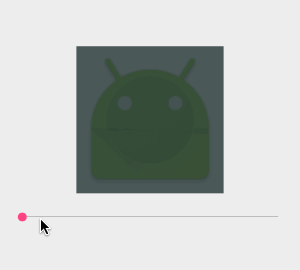

### Android ProgressImageView

An iOS style progress ImageView.

#### Demo



#### Usage

gradle :

```java
    dependence {
        compile 'me.ydcool.lib:progressimageview:latest.integration'
    }
```

in your layout xml:

```xml
<me.ydcool.lib.progressimageview.ProgressImageView
        android:id="@+id/Main_piv"
        android:layout_width="200dp"
        android:layout_height="200dp"
        android:src="@mipmap/ic_launcher"
        app:pi_mask_color="#CC233333"
        app:pi_progress="0"
        app:pi_radius="60dp"
        app:pi_stroke="6dp"/>
```

#### Attributes

| name | description |
| ---- | ----------- |
| `pi_mask_color` | |
| `pi_progress` |  |
| `pi_radius` |  |
| `pi_stroke` |  |

#### TODO

* support for pause and resume

#### License

[Apache License 2.0](LICENSE)